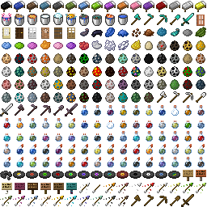

# glyph_E1.png Generator
  
  
This script is to generate a "font/glyph_E1.png" in Minecraft resource pack.  
You can display a custom image on chat, tip or title in Minecraft by input accurate unicode text.  
Successful execution of this script will generate a newly edited image "glyph_E1.png" and a dictionary file "pictogram.ini" representing Unicode character and pictogram combinations.

<details><summary>日本語</summary><div>
このスクリプトはリソースパックのfont/glyph_E1.pngを生成するツールです。<br />
ユニコード文字を入力することで任意の絵文字画像をMinecraftのゲームのチャットやタイトルに表示できるようになります。<br />
このスクリプトの実行に成功すると、新たに編集された画像「glyph_E1.png」と、ユニコード文字と絵文字の組み合わせを表す辞書ファイル「pictogram.ini」が生成されます。
</div></details><br /><br />
  
## Environment ｜ 環境
Python must be executable.

<details><summary>日本語</summary><div>
Pythonが実行可能であること
</div></details><br /><br />
  
## Usage ｜ 使用法
1. Clone this repository.
2. Open a command prompt in the directory containing "main.py".
3. Generate and activate the python virtual environment.
```
> python -m venv env
> cd env/Scripts & activate & cd ../..
```
4. Install the required modules.
```
(env) > python -m pip install -r requirements.txt
```
5. Execute "main.py".
```
(env) > python main.py
```
6. Insert pictogram images into the generated "icons" folder.
7. Execute "main.py" again.
```
(env) > python main.py
```
8. Dictionary and PNG files are generated in the /dest directory :D

<details><summary>日本語</summary><div>
コマンドは上記を参照
<ol>
    <li>このリポジトリをクローンする</li>
    <li>main.pyがあるディレクトリでコマンドプロンプトを開く</li>
    <li>仮想環境を生成して有効化する</li>
    <li>必須モジュールをインストールする</li>
    <li>main.pyを実行する</li>
    <li>生成された「icons」フォルダに任意の絵文字画像を入れる</li>
    <li>再びmain.pyを実行するとdestフォルダに生成されます</li>
    <li>/destのディレクトリに辞書ファイルとPNGファイルが生成されます</li>
</ol>
</div></details><br /><br />
  
## Files details ｜ ファイルの詳細
|File name|Description|
|:---|:---|
| main.py | Python script file |
| /icons | Directory of pictogram image |
| /dest | Directory where the generated files will be placed |
| /dest/glyph_E1.png | Generated glyph_E1.png |
| /dest/pictogram.ini | Generated pictogram.ini |

<details><summary>日本語</summary><div>
<table>
    <tr>
        <th>File name</th>
        <th>Description</th>
    </tr>
    <tr>
        <td>main.py</td>
        <td>Pythonのスクリプトファイル</td>
    </tr>
    <tr>
        <td>/icons</td>
        <td>追加したい絵文字のディレクトリ</td>
    </tr>
    <tr>
        <td>/dest</td>
        <td>生成されたファイルが入るディレクトリ</td>
    </tr>
    <tr>
        <td>/dest/glyph_E1.png</td>
        <td>生成されたglyph_E1.png</td>
    </tr>
    <tr>
        <td>/dest/pictogram.ini</td>
        <td>生成されたpictogram.ini</td>
    </tr>
</table>
</div></details><br /><br />

## MUST READ ｜ 必読
- The aspect ratio of all pictogram images should be 1:1. (16x16 pixels is preferable)
- Be sure to place the pictogram image [centered to the left.](assets/image_validation.png)
- Be sure to use English file names for pictogram images.
- The pictograms are placed in ascending order of the names of the images in the "icons" directory. If you wish to specify the order, use a delimiter "#" to set the order. (Example: "a#zombie")
- The dictionary file is generated using the file name of the pictogram image as it is. If there is a delimiter, the second half will be the definition name.

<details><summary>日本語</summary><div>
<ul>
    <li>絵文字画像の縦横比は全て1:1にしてください。(16×16ピクセルが望ましい)</li>
    <li>必ず、<a href="assets/image_validation.png">左寄り中央</a>に絵文字画像を配置してください。</li>
    <li>必ず、絵文字の画像のファイル名を英語にしてください。</li>
    <li>指定したディレクトリ内の画像の名前の昇順に絵文字設置していきます。順序を定めたい場合は区切り文字で順番を決めてください。(例「a#zombie」)</li>
    <li>絵文字画像のファイル名をそのまま利用して、辞書ファイルを生成します。区切り文字「#」があれば後半が定義名になります。</li>
</ul>
</div></details>
